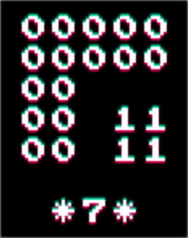

**If you don't know who "The Trash Cell" is, you can just close this page again. The repository is only public because there is no such thing as an unlisted repo on GitHub.**

# The Trash Cell ARG

This document is a collection of all resources and theories around the ARG.

## Discord links

The Trash Cell: https://discord.gg/thetrashcell <br />
Trash Cell ARG: https://discord.gg/qrycyaDYcv

## Resources

### "Construct" (Image)

> **Source:** Discord <br />
> **Date of release:** 04.12.2022, 16:49:04 UTC <br />
> **Link:** https://discord.com/channels/852889827229564958/1049003303574446100/1049004423713657004
> - [PNG](./resources/construct.png)


### "worst_piggies" (Audio)

> **Source:** Discord <br />
> **Date of release:** 06.12.2022, 21:23:33 UTC <br />
> **Link:** https://discord.com/channels/852889827229564958/1049003303574446100/1049798276133683241
> *It seems like this has no direct connection to the ARG, there is no message hidden inside.*
> - [MP3](./resources/worst_piggies.mp3)
  
<audio controls style="width: 320px; max-width: 100%;">
    <source src="./resources/worst_piggies.mp3" type="audio/mpeg">

https://raw.githubusercontent.com/blaumeise20/troh-arg/main/resources/worst_piggies.mp3

</audio>

### "fund" (Image)

> **Source:** Discord <br />
> **Date of release:** 13.12.2022, 08:40:53 UTC <br />
> **Link:** https://discord.com/channels/852889827229564958/1049003303574446100/1052143060869459970
> - [PNG](./resources/fund.png)



### "manage_leak" (Video)

> **Source:** Discord <br />
> **Date of release:** 25.12.2022, 20:07:16 UTC <br />
> **Link:** https://discord.com/channels/852889827229564958/1049003303574446100/1056664448376516639
> - [MP4](./resources/manage_leak.mp4)

<video width="320" height="240" controls style="max-width: 100%; height: auto;">
    <source src="./resources/manage_leak.mp4" type="video/mp4">

https://raw.githubusercontent.com/blaumeise20/troh-arg/main/resources/manage_leak.mp4

</video>

### "A Snowy Announcement! :D" (Video)

> **Source:** YouTube <br />
> **Date of release:** 30.12.2022, 22:00:10 UTC <br />
> **Link:** https://www.youtube.com/watch?v=y-VWpgcfkl4
> **Description:** <br />
> ```
> ✅ My Discord: https://discord.gg/thetrashcell
> Cell Machine Discord: https://discord.gg/579vPXsTCF 
> 
> The trash cell attempting to promote their discord for 2 minutes straight
> Jokes aside, I spent way too much time on this entire thing. Hoping to maintain discord partnership and get some hype over Cell Machine YouTube lol
> 
> Thanks for watching the thing! It means a lot to me (:
> ```
> - [WebM (Original)](./resources/snowy.webm)
> - [MP4](./resources/snowy.mp4)

<video width="320" height="240" controls style="max-width: 100%; height: auto;">
    <source src="./resources/snowy.mp4" type="video/mp4">

https://raw.githubusercontent.com/blaumeise20/troh-arg/main/resources/snowy.mp4

</video>

### "2_beats" + "3_beats" + "4_beats" (Audio)

> **Source:** Discord <br />
> **Date of release:** 02.01.2023, 13:24:31 UTC <br />
> **Link:** https://discord.com/channels/852889827229564958/1049003303574446100/1059462196574310441
> *It seems like this has no direct connection to the ARG, there is no message hidden inside.*
> - [WAV (2_beats)](./resources/2_beats.wav)
> - [WAV (3_beats)](./resources/3_beats.wav)
> - [WAV (4_beats)](./resources/4_beats.wav)

<audio controls style="width: 320px; max-width: 100%;">
    <source src="./resources/2_beats.wav" type="audio/x-wav">

https://raw.githubusercontent.com/blaumeise20/troh-arg/main/resources/2_beats.wav

</audio>

<audio controls style="width: 320px; max-width: 100%;">
    <source src="./resources/3_beats.wav" type="audio/x-wav">

https://raw.githubusercontent.com/blaumeise20/troh-arg/main/resources/3_beats.wav

</audio>

<audio controls style="width: 320px; max-width: 100%;">
    <source src="./resources/4_beats.wav" type="audio/x-wav">

https://raw.githubusercontent.com/blaumeise20/troh-arg/main/resources/4_beats.wav

</audio>

### "An actual Self-Solving Vault | Cell Machine Plus" (Video)

> **Source:** YouTube <br />
> **Date of release:** 02.01.2023, 18:15:22 UTC <br />
> **Link:** https://www.youtube.com/watch?v=j24KZ06d1fM
> **Description:** <br />
> ```
> friendly fire
> 
> Join my Discord to discuss Cell Machine, the best game ever: https://discord.gg/thetrashcell
> Cell Machine Plus available here: https://traloc-dheckoa.itch.io/cmmm
> 
> Definitely one of my favourite CMMM+ cells now. And one of the best vault crackers too.
> Enjoy the video, thanks for watching, subscribe, blah blah. I really appreciate it :D
> ```
> - [WebM (Original)](./resources/vault.webm)
> - [MP4](./resources/vault.mp4)

<video width="320" height="240" controls style="max-width: 100%; height: auto;">
    <source src="./resources/vault.mp4" type="video/mp4">

https://raw.githubusercontent.com/blaumeise20/troh-arg/main/resources/vault.mp4

</video>

TODO: Add Cell Industries resources here

## Theories/Findings

TODO: Add theories/findings here
