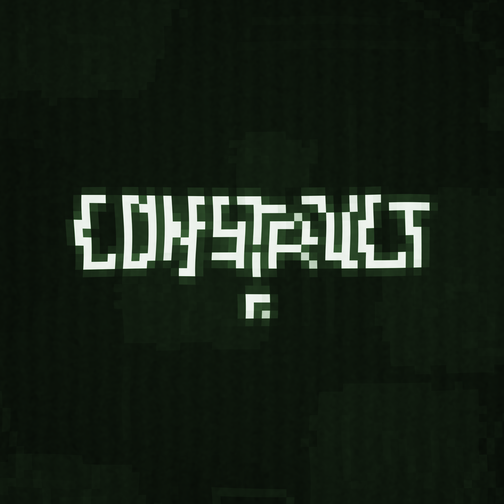
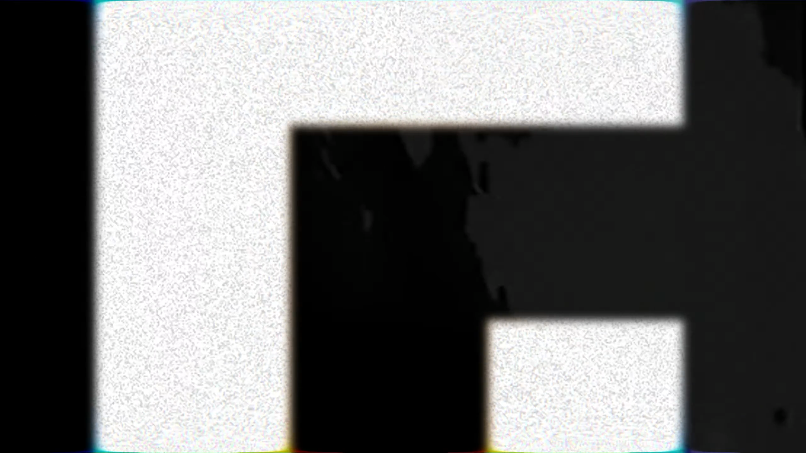

**If you don't know who "The Trash Cell" is, you can just close this page. The repository is only public because there is no such thing as an unlisted repo on GitHub.**

# The Trash Cell ARG

This document is a collection of all resources and theories around the ARG.

## Discord links

The Trash Cell: https://discord.gg/thetrashcell  
Trash Cell ARG: https://discord.gg/qrycyaDYcv

## Resources

### "Construct" (Image)

> **Source:** Discord  
> **Date of publishing:** 04.12.2022, 16:49:04 UTC  
> **Link:** https://discord.com/channels/852889827229564958/1049003303574446100/1049004423713657004
> - [PNG](./resources/construct.png)

### "fund" (Image)

> **Source:** Discord  
> **Date of publishing:** 13.12.2022, 08:40:53 UTC  
> **Link:** https://discord.com/channels/852889827229564958/1049003303574446100/1052143060869459970
> - [PNG](./resources/fund.png)

### "Cell Indistries" (Image)

> **Source:** Discord  
> **Date of publishing:** 24.12.2022, 16:52:48 UTC  
> **Link:** https://discord.com/channels/852889827229564958/974777368860319824/1056253121032106034
> - [PNG](./resources/image.png)

### "manage_leak" (Video)

> **Source:** Discord  
> **Date of publishing:** 25.12.2022, 20:07:16 UTC  
> **Link:** https://discord.com/channels/852889827229564958/1049003303574446100/1056664448376516639
> - [MP4](./resources/manage_leak.mp4)

### "A Snowy Announcement! :D" (Video)

> **Source:** YouTube  
> **Date of publishing:** 30.12.2022, 22:00:10 UTC  
> **Link:** https://www.youtube.com/watch?v=y-VWpgcfkl4
> Contains a glitch segment at 01:00, refered to as "glitch 1".
> - [WebM (Original)](./resources/snowy.webm)
> - [MP4](./resources/snowy.mp4)

### "An actual Self-Solving Vault | Cell Machine Plus" (Video)

> **Source:** YouTube  
> **Date of publishing:** 02.01.2023, 18:15:22 UTC  
> **Link:** https://www.youtube.com/watch?v=j24KZ06d1fM
> Contains a glitch segment at the very end (02:22), refered to as "glitch 2".
> - [WebM (Original)](./resources/vault.webm)
> - [MP4](./resources/vault.mp4)

## Irrelevant

### "2_beats" + "3_beats" + "4_beats" (Audio)

> **Source:** Discord  
> **Date of publishing:** 02.01.2023, 13:24:31 UTC  
> **Link:** https://discord.com/channels/852889827229564958/1049003303574446100/1059462196574310441  
> *It seems like this has no direct connection to the ARG, there is no message hidden inside.*
> - [WAV (2_beats)](./resources/2_beats.wav)
> - [WAV (3_beats)](./resources/3_beats.wav)
> - [WAV (4_beats)](./resources/4_beats.wav)

### "worst_piggies" (Audio)

> **Source:** Discord  
> **Date of publishing:** 06.12.2022, 21:23:33 UTC  
> **Link:** https://discord.com/channels/852889827229564958/1049003303574446100/1049798276133683241  
> *It seems like this has no direct connection to the ARG, there is no message hidden inside.*
> - [MP3](./resources/worst_piggies.mp3)

## Theories/Findings

Anything in this section not marked with "THEORY" is a simple discovery or collection of known facts.

### Logo of "Cell Indistries"

If we take a look at the icon below the text in "Construct" and "manage_leak", it forms this shape:

 (reconstructed)

This same shape also occurs in the video "A Snowy Announcement! :D" in glitch 1:

Interestingly, the logo of "Cell Indistries" has the exact reversed shape:

 (reconstructed)

If you look at the second part of glitch 1, we can see that there is a bottom right angle too, just as in the "Cell Indistries" logo:

[THEORY] If we were to combine the two logos, we would get this:

  
*This exact shape/combination has not been verified yet.*

[LIKELY THEORY] The amount of places where the shape occurs shows that this shape has to be the main icon of this ARG.

### Text in glitch 1

### Morse code in glitch 2

### Dimensions of "fund"

### Replacement of 'i' with 'u' (and vice versa)

[THEORY] The name of "Cell Indistries" is clearly misspelled. If you look at the replaced character, it's an 'u' replaced by 'i'. This is also the case in the name of "fund", leading to a name of "find.png" if you replace the 'u' with an 'i'.

*The connection of the letter swapping has not been verified yet.*

### Letters in "Construct"

[UNLIKELY THEORY] If you turn around with the gradiation curve of "Construct", you get this:

There are a few lines and shapes in there that look out of place:

These have not been decoded yet, but they might be letters.
